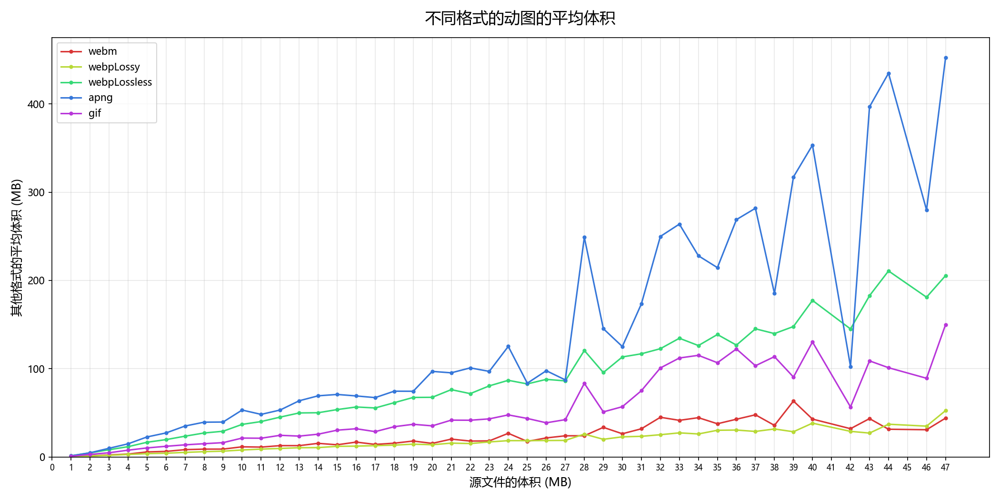

# 动图保存为不同格式时的体积

## 测试条件

### 作品 ID 列表

我搜索了动图的 tag `うごイラ`：
https://www.pixiv.net/tags/%E3%81%86%E3%81%94%E3%82%A4%E3%83%A9/artworks?ai_type=1

搜索条件设置为不显示 AI 作品。

我抓取了多个页面的 ID 列表，共 1016 个动图 ID。这些页面是跳着抓取的，分别是：
- 第 100 页
- 第 150 页
- 第 200 页
- 第 250 页
- 第 300 页
- 第 350 页
- 第 400 页
- 第 450 页
- 第 500 页
- 第 550 页
- 第 600 页
- 第 650 页
- 第 700 页
- 第 800 页
- 第 900 页
- 第 1000 页

之所以跳着抓取（而不是连续抓取多页），是为了让测试的作品更加随机一些。

这些作品里最大的 ID 是 144282215，日期是 2026年5月3日。最小的 ID 是 132272274，日期是 2025年7月3日。日期跨度为 10 个月。

### 下载器的设置

下载设置为同时下载 3 个文件，同时转换 1 个动图（我怕同时转换的数量太多会导致页面内存超出限制而崩溃）。

使用下载器把每个动图都转换为 6 种格式：
- WebP 有损
- WebP 无损
- WebM
- GIF
- APNG
- Ugoria

没有保存 zip 文件：考虑到 zip 和 ugoira 是相同的文件，为了减小硬盘体积占用，我没有保存 zip 文件。

另外由于 WebP 只能单选有损或无损，所以我分成了两次下载：第一次选择 WebP 有损，并下载所有格式的文件。第二次只下载 WebP 无损格式。这样文件就齐全了。

### 日期

测试日期：2026-05-04
浏览器版本：Chrome 正式版 147
下载器版本：18.9.0

## 测试结果

下载顺利完成了，标签页没有崩溃。

### 数据分析

一共 1016 个动图，每个动图有 6 个对应的文件，文件总数是 `6096`，体积一共是 `128.13` GiB。

我让 AI 帮我编写 PowerShell 7 脚本，把每个文件的体积汇总到 CSV 文件里（单位是 `MiB`,保留小数点后 2 位）。然后统计了每种格式的总体积、平均体积、相对于源文件体积的百分比：

| 数据          | ugoira  | webm    | webpLossy | webpLossless | apng     | gif      |
| ------------- | ------- | ------- | --------- | ------------ | -------- | -------- |
| total (MiB)   | 9614.34 | 9937.64 | 7576.41   | 35162.12     | 48390.91 | 20530.63 |
| average (MiB) | 9.46    | 9.78    | 7.46      | 34.61        | 47.63    | 20.21    |
| percentage    | 100%    | 103.36% | 78.80%    | 365.72%      | 503.32%  | 213.54%  |

### 体积的比例

以源文件（ZIP 或 Ugoria）的体积为 100%，把它们排在前面，其他格式按照体积从小到大排列：

| 格式   | 质量 | 百分比 |
| ------ | ---- | ------ |
| ZIP    | 无损 | 100%   |
| Ugoria | 无损 | 100%   |
| WebP   | 有损 | 79%    |
| WebM   | 有损 | 103%   |
| GIF    | 有损 | 214%   |
| WebP   | 无损 | 366%   |
| APNG   | 无损 | 503%   |

PS：WebP（无损）的体积是 WebP（有损）的 4.5 倍左右。

### 相关文件

- ID 列表文件：`1016个动图-idList.json`
- 抓取结果文件：`1016个动图-result.zip`
- 脚本文件：`exportFileSizeToCSV.ps1`
- 体积统计文件：`fileSizeResult.xlsx`（虽然脚本导出的是 CSV 文件，但为了保存公式和固定首行，我在编辑时把它转换成了 XLSX 文件）
- 体积统计文件：`fileSize.json`
- 以 MB 为单位区间，统计源文件对应的其他格式的平均体积：`fileSizeAverage.json`
- 上一条对应的图表：

对该图表的说明：
- 该图表反映了对于不同体积的源文件，其转换后的各种格式的平均体积。
- X 轴是源文件大小，以 1 MB 为单位。每个数字 n 表示的是 `n-1` - `n` MB 的源文件。
- Y 轴的数据是 X 轴上对应体积的源文件转换后，每种格式的文件的平均体积。
- 由于体积越大的源文件数量越少，所以右侧区域的数据样本量较少，不够准确。

可以看出：
- WebP 有损压缩的图片体积最小，并且体积随源文件体积增加的幅度也最稳定，体积可预测。
- WebM 体积只比 WebP 稍大一点，体积增长也比较稳定。
- GIF、WebP 无损压缩、APNG 的体积一个比一个大。其中 WebP 的体积增长幅度依然很稳定，体积波动幅度小。GIF 波动幅度大一些，APNG 的波动幅度最大，体积很不稳定。