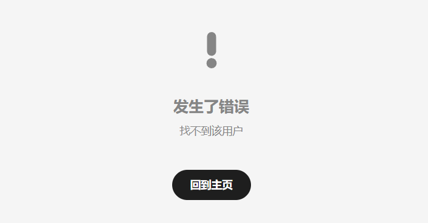
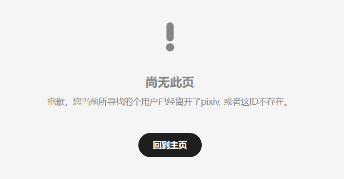

# 用户已注销或不存在的状态码 403 404

日期：2026-05-17

在关注页面里，下载器有个功能按钮是“查找已注销的用户”。

原理是：当请求一个用户数据时，如果状态码是 403，就认为该用户已注销。

之前我只观察到了 403 状态码（这种情况比较常见），现在发现还有 404 的（相对少见）。现在下载器会把 404 的也视为已注销。

这两种状态码的提示内容不同，另外在尝试获取用户的 `/profile/all` 数据时表现也不同。

## 403 示例

https://www.pixiv.net/ajax/user/21928460?full=0

```json
{
    "error": true,
    "message": "找不到该用户",
    "body": []
}
```

访问[该用户的主页](https://www.pixiv.net/users/21928460)，会显示同样的提示：



状态码为 403 的用户，其数据并未完全删除，例如可以获取其全部作品的 ID 列表：

https://www.pixiv.net/ajax/user/21928460/profile/all

这个 API 的状态码是 200，返回的数据看起来也比较正常。我没有把返回的数据与正常用户的数据做详细对比，但至少是可以获取作品 ID 列表的。不过实际上无法抓取这些作品，因为获取作品数据时会产生 404 错误。

## 404 示例

https://www.pixiv.net/ajax/user/7194518?full=0

```json
{
    "error": true,
    "message": "抱歉，您当前所寻找的个用户已经离开了pixiv, 或者这ID不存在。",
    "body": []
}
```

访问[该用户的主页](https://www.pixiv.net/users/7194518)，会显示同样的提示：



状态码为 404 的用户，其数据被完全删除了，不能获取其全部作品的 ID 列表：

https://www.pixiv.net/ajax/user/7194518/profile/all

这个 API 的状态码也是 404，返回的内容与上面的 JSON 完全相同，所以没有作品 ID 列表，也无法进行抓取。


